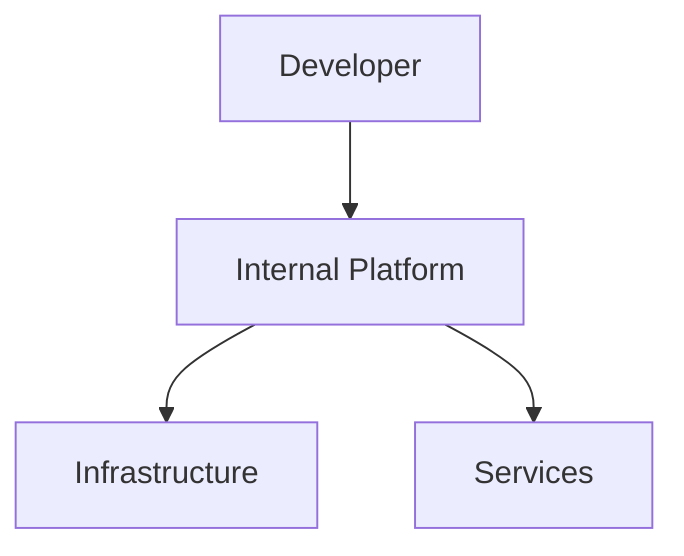

## 🎯 문제 정의

[해결하고자 하는 개발자 경험 문제]

## 🏗️ 솔루션 아키텍처

### 전체 구조

### 핵심 컴포넌트

1. **컴포넌트 1**
   - 역할과 책임
   - 기술 스택

2. **컴포넌트 2**
   - 역할과 책임
   - 기술 스택

## 🚀 구현 과정

### Phase 1: MVP 구축

### Phase 2: 기능 확장

### Phase 3: 최적화

## 📈 성과 측정

### 개발자 경험 지표
- **배포 시간**: Before vs After
- **오류율**: Before vs After
- **개발자 만족도**: 설문 결과

### 비즈니스 임팩트
- **개발 속도 향상**
- **운영 비용 절감**
- **안정성 개선**

## 🎓 교훈 및 베스트 프랙티스

### 성공 요인
1. 
2. 
3. 

### 주의사항
1. 
2. 
3. 

## 🔮 다음 단계

## 🔗 참고 자료

- [Platform Engineering 가이드](URL)
- [Team Topologies](URL)

---

**관련 글**
- [이전 글 제목](링크)
- [다음 글 제목](링크)
