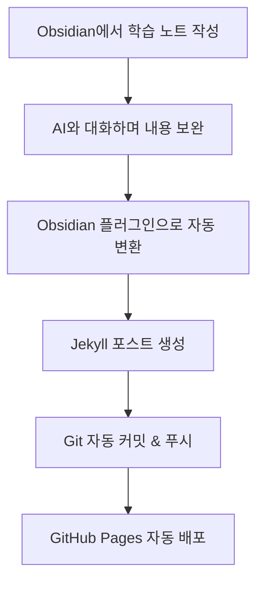

# AI + Obsidian + Git 자동화 워크플로우

## 🔄 전체 프로세스



## 🛠️ 필요한 도구들

### 1. Obsidian 플러그인
- **Templater**: 포스트 템플릿 자동 생성
- **Git**: Obsidian에서 직접 Git 관리
- **Advanced Tables**: 테이블 자동 포맷팅

### 2. GitHub Actions 워크플로우
```yaml
# .github/workflows/obsidian-sync.yml
name: Obsidian to Blog Sync
on:
  push:
    paths: ['obsidian-notes/**']
jobs:
  convert-and-deploy:
    runs-on: ubuntu-latest
    steps:
    - uses: actions/checkout@v3
    - name: Convert Obsidian to Jekyll
      run: python automation/obsidian-to-blog.py
    - name: Deploy to GitHub Pages
      uses: peaceiris/actions-gh-pages@v3
```

### 3. AI 통합 스크립트
```python
# AI와 대화한 내용을 자동으로 정리
def ai_conversation_to_post(conversation_log):
    # ChatGPT/Claude 대화 로그 파싱
    # 핵심 내용 추출
    # Jekyll 포스트 형태로 변환
    pass
```

## 📋 Obsidian 템플릿

### 기술 학습 템플릿
```markdown
---
title: {{title}}
date: {{date}}
category: {{category}}
ai_tools: [ChatGPT, Claude, Amazon Q]
---

## 🎯 학습 목표
- 

## 🤖 AI와의 대화 요약
### 주요 질문들
- 

### 핵심 답변들
- 

## 💡 핵심 인사이트
- 

## 🔗 참고 자료
- 

## 📝 다음 학습 계획
- 
```

## ⚡ 자동화 스크립트 실행

### 1. 일일 동기화
```bash
# crontab 설정
0 18 * * * cd /path/to/blog && python automation/obsidian-to-blog.py
```

### 2. 실시간 동기화
```bash
# fswatch를 사용한 파일 변경 감지
fswatch -o /path/to/obsidian/vault | xargs -n1 python automation/obsidian-to-blog.py
```

## 🎨 고급 기능들

### 1. AI 대화 로그 자동 파싱
- ChatGPT 대화 내용을 자동으로 마크다운으로 변환
- 핵심 내용만 추출하여 포스트 생성

### 2. 이미지 자동 최적화
- Obsidian 첨부 이미지를 자동으로 압축
- Jekyll assets 폴더로 자동 이동

### 3. 태그 자동 분류
- AI를 활용한 자동 태그 생성
- 카테고리 자동 분류

### 4. SEO 최적화
- 자동 메타 태그 생성
- 소셜 미디어 카드 이미지 생성
